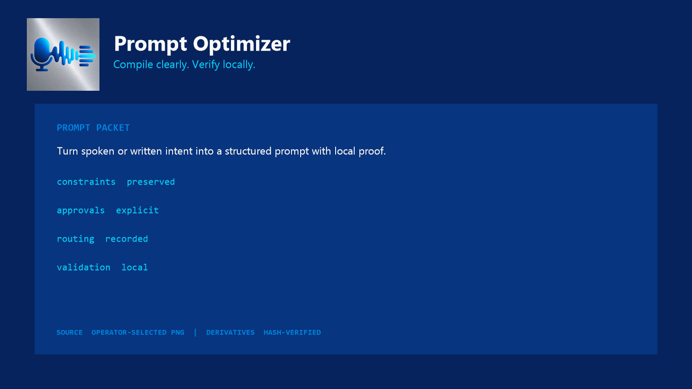

# Prompt Optimizer

Constraint-safe prompt compilation for agent workflows.

> **Current release.** Prompt Optimizer `v0.1.2` uses the public developer display name `Orbral` and ships the operator-selected Agent Smith Palette identity while preserving the post-release 30-day maintainer pilot.

Prompt Optimizer helps developers turn long or messy agent requests into lean, reviewable prompt packets without silently dropping constraints or widening authority.

It is deliberately a two-part tool:

| Surface | What it does | What it does not do |
|---|---|---|
| Bundled agent skill | Makes the semantic compilation: selects material sections and maps every must-preserve constraint. | It cannot invent approval, expand scope, execute the source task, or guarantee better model output. |
| Dependency-free CLI | Fingerprints the exact source, creates a safe draft, validates custody and authority, shows a trace, and renders only a passing packet. | It never semantically rewrites a long prompt, calls a model, or executes the prompt. |

Here, **optimized** means compiled by the skill and checked against an explicit custody contract. It does not mean empirically proven to improve model performance.



## One-command demo

From the repository root:

```bash
python tools/demo.py
```

Exact output:

```text
Audit the repository feature, identify the failing behavior, and repair only that defect.

Work in the current repository.

Fix only the defect and preserve existing user changes.
Do not publish, push, change credentials, or widen scope.

Run the relevant tests and report the exact validation results.

Return the changed files, remaining risks, and any manual decision.

Before finishing, confirm that the requested defect is fixed and existing user changes remain intact.
```

The demo validates the committed source prompt and complete prompt packet before printing anything. No network or API key is involved.

To inspect exactly where the two source constraints landed:

```bash
prompt-optimizer trace --prompt-file plugins/prompt-optimizer/examples/long-request.txt --brief-file plugins/prompt-optimizer/examples/optimized-brief.json
```

The JSON trace includes each source constraint, its verbatim or semantic disposition, compiled text, destination section, authorization boundary, and a reminder that structural validation is not proof of semantic equivalence.

## What it catches

- A compiled prompt that no longer matches its ordered sections.
- A must-preserve constraint with no one-to-one source mapping.
- A changed source prompt or stale SHA-256 fingerprint.
- External or scope-expanding authority marked approved without evidence.
- Fabricated compiler sections for a short prompt that should remain unchanged.
- Chain-of-thought and “think harder” scaffolding.
- Unknown receipt fields that would make the contract ambiguous.

## Install from a local checkout

These commands install the candidate from the current directory. `pip install prompt-optimizer` from a package index is **not** an available or tested path for this candidate.

```bash
python -m pip install .
prompt-optimizer --version
prompt-optimizer analyze --prompt-file plugins/prompt-optimizer/examples/long-request.txt
prompt-optimizer validate --prompt-file plugins/prompt-optimizer/examples/long-request.txt --brief-file plugins/prompt-optimizer/examples/optimized-brief.json
prompt-optimizer trace --prompt-file plugins/prompt-optimizer/examples/long-request.txt --brief-file plugins/prompt-optimizer/examples/optimized-brief.json
```

Python 3.10 or later is required. The runtime uses only the Python standard library.

## The workflow

1. `analyze` counts relevant sentences, honors explicit skip language, fingerprints the source, and surfaces conservative constraint candidates.
2. `scaffold` creates either a safe draft envelope for a long prompt or a complete unchanged envelope for a short/explicitly skipped prompt.
3. The bundled skill compiles only the material sections and maps every must-preserve constraint.
4. `validate` checks source custody, section ordering, constraint placement, authorization boundaries, and validation evidence.
5. `trace` exposes every constraint mapping and authority decision for review.
6. `render` emits the compiled prompt only after validation passes.

The safe fallback is always the original prompt unchanged.

When `scaffold --output` is used, the CLI creates a new file only. It refuses an existing destination or final-component symlink and never offers a validation or overwrite bypass.

## Why the draft scaffold does not rewrite your prompt

A deterministic script cannot responsibly infer the full meaning of arbitrary natural-language instructions. Prompt Optimizer therefore separates responsibilities: the agent handles semantic judgment; the CLI handles repeatable custody and validation. A long-prompt scaffold is intentionally marked `draft` and cannot pass `validate` or `render` until it is completed.

## Receipt contract

Every complete packet keeps:

- the exact original prompt and SHA-256 fingerprint;
- the target surface and trigger decision;
- seven canonical compiler sections, each included or omitted with a reason;
- must-preserve constraints and their exactly-once compiled placement;
- local, external, and scope-expansion authorization boundaries;
- a concrete validation plan.

Prompt files are read as strict UTF-8 bytes. The CLI preserves BOM and newline code points and hashes that exact byte sequence; it does not silently remove a BOM or canonicalize CRLF to LF.

See [the compiler contract](docs/COMPILER-CONTRACT.md) and [receipt guide](docs/RECEIPTS.md).

Prompt packets intentionally retain the exact source text. Keep them local, treat them as sensitive artifacts, and do not place credentials or secrets in a prompt packet. The CLI does not upload or transmit them.

## Evidence status

| Claim | Status | What the evidence supports |
|---|---|---|
| Deterministic custody and validation | Passing | Unit/regression tests and the native eval cover trigger behavior, source mismatch, draft blocking, unknown fields, approvals, rendering, and repeatability. |
| Clean local packaging | Passing | A fresh Python 3.12 wheel install has no runtime dependencies and the installed commands pass. |
| OpenAI/Codex plugin shape | Passing | The current official local plugin validator accepts the packaged plugin. |
| Claude plugin shape | Passing | The Claude manifest and marketplace pass native Claude Code validation. |
| Better downstream model performance | Not claimed | No representative baseline-versus-compiled model benchmark has been completed for this release. |

## Category boundary

| Tool category | Primary job | Prompt Optimizer's boundary |
|---|---|---|
| Hosted prompt optimizer | Suggest and manage prompt revisions | This project is local, provider-neutral at the skill core, and has no hosted model call. |
| Evaluation framework | Run prompts against models, graders, or red-team cases | This project validates prompt packets; it does not replace behavioral evals. |
| Prompt template collection | Supply reusable wording | This project supplies a compiler contract and custody receipt, not a prompt library. |

## Plugin distribution

The repository contains one skills-only plugin at `plugins/prompt-optimizer`, with OpenAI/Codex and Claude Code wrappers around the same skill core.

Install in Codex from GitHub:

```bash
codex plugin marketplace add SpannDaMan/prompt-optimizer
codex plugin add prompt-optimizer@prompt-optimizer
```

Install in Claude Code from GitHub:

```text
/plugin marketplace add SpannDaMan/prompt-optimizer
/plugin install prompt-optimizer@prompt-optimizer
```

See [Codex installation](docs/CODEX-INSTALL.md), [Claude Code installation](docs/CLAUDE-INSTALL.md), and the [OpenAI submission packet](docs/OPENAI-PLUGIN-SUBMISSION.md).

## Why Prompt Optimizer comes before Agent Smith Router

Prompt Optimizer turns an unstructured request into a validated packet containing the outcome, constraints, authorization boundary, evidence requirements, and task shape. A future routing plugin can use those fields as cleaner routing inputs.

That can reduce ambiguity; it does not guarantee that a router will make a better decision. Current capability, cost, risk, availability, and verification evidence still matter. Read the [Prompt Optimizer to Agent Smith Router bridge](docs/AGENT-SMITH-ROUTER-BRIDGE.md).

## Support and sustainability

- Reproducible bugs and bounded feature requests belong in GitHub Issues after publication.
- Team rollout, private customization, and managed-support questions should follow [SUPPORT.md](SUPPORT.md).
- [`.github/FUNDING.yml`](.github/FUNDING.yml) is prepared for `SpannDaMan`; the sponsor button activates only after the maintainer completes GitHub Sponsors enrollment.
- Launch success is measured beyond stars; see [LAUNCH-MEASUREMENT.md](docs/LAUNCH-MEASUREMENT.md).

## Trust and security

- No runtime dependencies.
- No credentials or provider configuration.
- No network requests or telemetry.
- Strict JSON fields and fail-closed rendering.
- Retrieved or pasted content remains data; it cannot change the skill's authority.
- Prompt packets retain the exact source and must be protected like the source itself.
- A prompt packet is validation evidence, not proof of semantic equivalence or downstream model compliance.

Read [SECURITY.md](SECURITY.md) and [THREAT-MODEL.md](THREAT-MODEL.md) before integrating untrusted prompt files.

## Status

`v0.1.2` is the current public release and changes only the public developer display name to `Orbral` after the v0.1.1 logo release; compiler behavior is unchanged. Local custody, package, plugin, schema, review, and visual gates pass. Public Git-source installation and directory review states are tracked separately from local package validity. The 30-day maintainer pilot runs after release; it may narrow, patch, or hold future releases without rewriting public history. See [PUBLICATION-GATE.md](PUBLICATION-GATE.md).

## Contributing

The smallest useful first change is a failing test that demonstrates a custody, validation, portability, or documentation defect. See [CONTRIBUTING.md](CONTRIBUTING.md).

MIT licensed. Maintained by SpannDaMan. See [PRIVACY.md](PRIVACY.md), [TERMS.md](TERMS.md), and the [30-day post-release maintainer pilot](MAINTAINER-PILOT.md).
